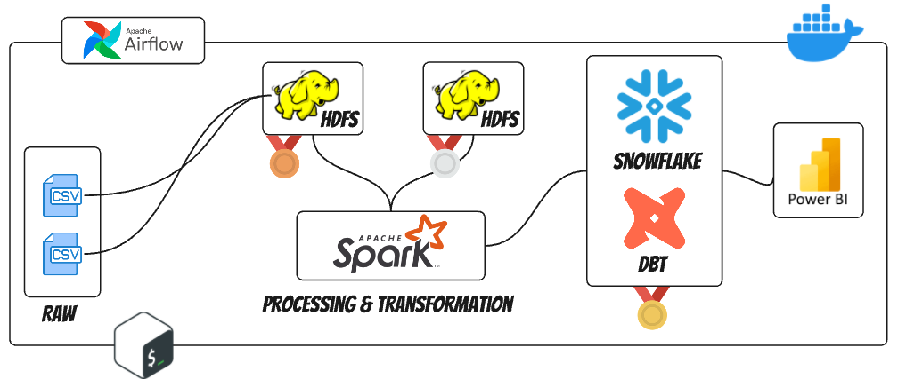
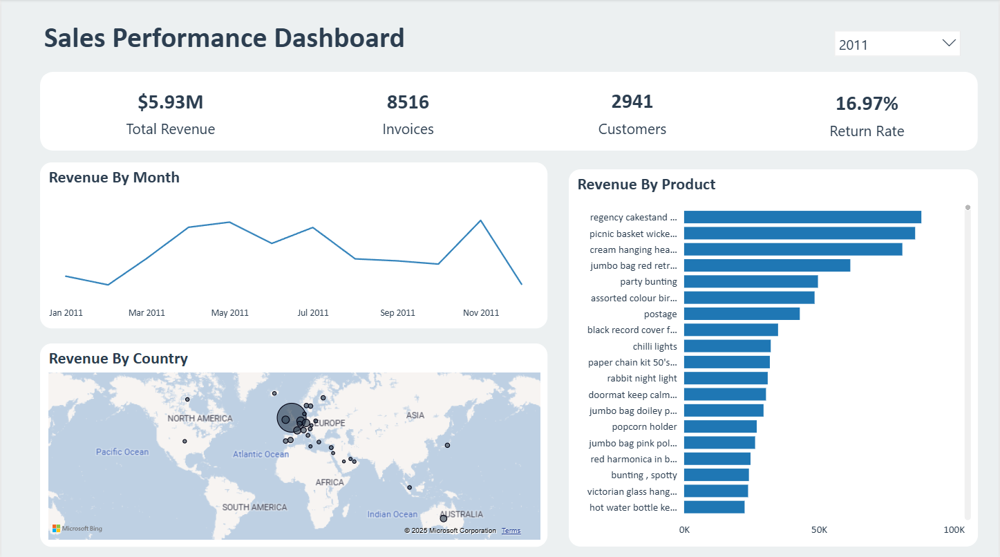

# 📈 Retail Sales Analytics Pipeline: Airflow, dbt & Docker Compose

This project showcases a comprehensive **Data Engineering workflow** designed to ingest, transform, and model raw retail sales data. Leveraging **Apache Airflow** for robust orchestration and **dbt (Data Build Tool)** for modular SQL-based transformations, the pipeline constructs a structured data warehouse optimized for analytics. The entire environment is containerized using **Docker Compose** for easy setup and local development.

---

## 🚀 Project Overview

This project aims to establish a robust and scalable data pipeline that transforms disparate retail sales data into a clean, structured, and analytics-ready format. By leveraging industry-standard tools, it enables efficient reporting and deeper insights into sales performance.

### 🔑 Key Features
* **Fully Containerized Environment:** Seamless setup and portability with Docker Compose (Airflow, dbt, Snowflake/PostgreSQL).
* **Automated Workflow Orchestration:** Scheduled execution of data transformations using Apache Airflow.
* **Modular Data Transformation:** Structured dbt project with best practices for SQL-based data modeling.
* **Dimensional Modeling (Star Schema):** Optimized data warehouse design for efficient analytical querying.
* **Data Quality & Testing (via dbt):** Implicitly covered by dbt's capabilities, worth mentioning if tests are implemented.

---

## 🛠️ Tech Stack

| Tool                      | Role                               |
| ------------------------- | ---------------------------------- |
| **Apache Airflow**        | Workflow orchestration             |
| **dbt (Data Build Tool)** | SQL-based data transformations     |
| **Docker Compose**        | Containerized development          |
| **Snowflake/PostgreSQL**  | Data warehouse / target backend    |
| **GitHub**                | Version control & CI/CD (optional) |

---

## 🗺️ Architecture Diagram

A visual representation of the data flow and component interactions within the pipeline.


*Figure 1: High-level overview of the Retail Sales Data Pipeline Architecture.*

---
## 📊 Retail Sales Analytics Dashboard

*Figure 2: Gold PowerBI Dashboard Connected to snowflake.*

---

## 📁 Project Structure

```plaintext
RETAIL_SALES/
│
├── docker-compose.yml              # Defines multi-container Docker application
├── dags/
│   └── dbt_dag.py                  # Airflow DAG for orchestrating dbt transformations
├── dbt/
│   └── retail_sales_project/
│       ├── dbt_project.yml         # dbt project configuration
│       ├── models/                 # dbt SQL models (staging, intermediate, marts)
│       │   ├── staging/            # Raw data transformation into staging tables
│       │   ├── marts/              # Final aggregated and dimensional models (e.g., Star Schema)
│       │   └── ...                 # Other model layers as needed
│       └── ...                     # Other dbt artifacts (macros, tests, seeds, etc.)
├── data/                           # Placeholder for raw input data (e.g., CSVs)
├── logs/                           # Airflow, Spark, or dbt log files
├── jars/                           # Custom JARs for Spark (if applicable)
├── notebooks/                      # Jupyter notebooks for data exploration or analysis
├── spark/                          # Spark application code or configurations (if Spark is used)
└── README.md
```

---

## ⚙️ Getting Started

### 1️⃣ Clone the Repository

```bash
git clone https://github.com/your-username/retail-sales-pipeline.git
cd retail-sales-pipeline
```

### 2️⃣ Start Docker Compose

```bash
docker-compose up --build
```

### 3️⃣ Access Airflow

- Web UI: [http://localhost:8080](http://localhost:8080)
- Default Login: `airflow / airflow`

### 4️⃣ Trigger the DAG

- Open Airflow UI
- Enable and trigger `dbt_transformation_dag`

---

## 📊 Data Modeling Layers

- **Staging Layer**: Cleans and standardizes raw data stored as view in snowflake
- **Mart Layer**: Star Schema with Fact and Dimension tables

### Dimensions and facts created

- `dim_customer`, `dim_product`, `dim_country`, `dim_date`, `fact_sales`

---
